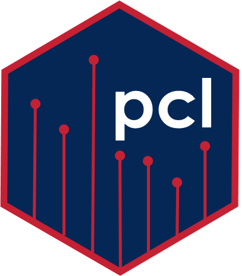

# pcl: portable canopy lidar data for the R programming language



This package contains canopy structural complexity data that collected from portable canopy lidar for 25 sites in North America. These data have been processed with
the forestr package in R. 

## Installation
```R
# Install the development version from GitHub
devtools::install_github("atkinsjeff/pcl")

```

## Usage
```R
# call the package
library(pcl)

# Then the data can be brought into the environment
pcl
```


