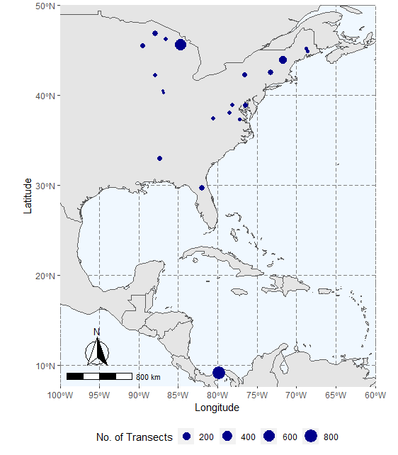

[](https://zenodo.org/badge/latestdoi/260939433)
# pcl: canopy structrual complexity data from portable canopy lidar


This package contains canopy structural complexity data collected from portable canopy 
lidar for 25 sites in North America. These data have been processed with the [forestr](https://cran.r-project.org/web/packages/forestr/index.html) package in R. 

## Installation
```R
# Install the development version from GitHub
devtools::install_github("atkinsjeff/pcl")

```

## Usage
```R
# call the package
library(pcl)

# Then the data can be brought into the environment
pcl
```


